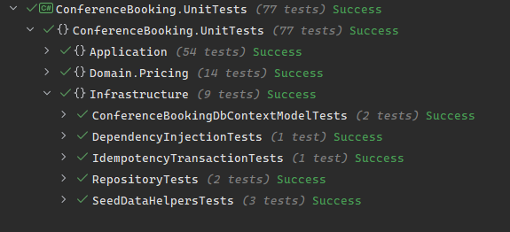
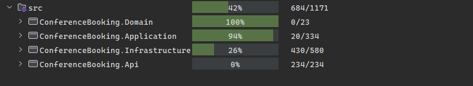

# Conference Hall Booking API

API для керування конференц-залами, додатковими послугами та їх бронюванням.

## Технологічний стек

- .NET 10
- ASP.NET Core
- Entity Framework Core
- PostgreSQL 18
- MediatR
- FluentValidation
- Ardalis.Specification
- Mapperly
- Swagger / OpenAPI
- xUnit
- Moq
- Testcontainers

## Як запустити

### Передумови

- .NET SDK 10
- Docker Desktop
- вільні порти `8080` і `5432`

### Запуск через Docker Compose

```bash
docker compose up --build
```

Після запуску:

- API: http://localhost:8080
- Swagger: http://localhost:8080/swagger/index.html
- PostgreSQL: localhost:5432


## Виконувані бізнес-завдання

Система дозволяє:

- створювати, редагувати та видаляти конференц-зали
- створювати, редагувати та видаляти додаткові послуги
- отримувати інформацію про зал
- шукати доступні зали за місткістю та часовим інтервалом
- створювати бронювання
- переглядати бронювання
- формувати звіти за вибраний період

Для бронювання діють такі обмеження:

- бронювання має відбуватися в межах одного календарного дня
- дозволений час — від `06:00` до `23:00`
- час завершення має бути пізнішим за час початку
- два бронювання одного залу не можуть перетинатися
- сусідні інтервали дозволені

Вартість оренди залежить від часу:

- `06:00–09:00` — знижка `10%`
- `09:00–12:00` — стандартний тариф
- `12:00–14:00` — надбавка `15%`
- `14:00–18:00` — стандартний тариф
- `18:00–23:00` — знижка `20%`

Ціна додаткової послуги зберігається у бронюванні на момент його створення. Подальше редагування послуги не змінює вже створені бронювання.

## API

Усі маршрути використовують версію API `v1`.

### Conference halls

| Метод | Маршрут | Опис |
|---|---|---|
| POST | `/api/v1/ConferenceHalls` | Створити конференц-зал |
| GET | `/api/v1/ConferenceHalls/{id}` | Отримати зал за ідентифікатором |
| GET | `/api/v1/ConferenceHalls/available` | Отримати доступні зали |
| PUT | `/api/v1/ConferenceHalls/{id}` | Оновити конференц-зал |
| DELETE | `/api/v1/ConferenceHalls/{id}` | Видалити конференц-зал |

Для пошуку доступних залів використовуються параметри:

- `capacity`
- `startTime`
- `endTime`
- `page`
- `pageSize`

### Bookings

| Метод | Маршрут | Опис |
|---|---|---|
| POST | `/api/v1/Bookings` | Створити бронювання |
| GET | `/api/v1/Bookings/{id}` | Отримати бронювання за ідентифікатором |
| GET | `/api/v1/Bookings` | Отримати список бронювань |

Після успішного створення бронювання API повертає `201 Created`, повну інформацію про бронювання та заголовок `Location`.

### Additional services

| Метод | Маршрут | Опис |
|---|---|---|
| POST | `/api/v1/AdditionalServices` | Створити додаткову послугу |
| GET | `/api/v1/AdditionalServices/{id}` | Отримати послугу за ідентифікатором |
| GET | `/api/v1/AdditionalServices` | Отримати список послуг |
| PUT | `/api/v1/AdditionalServices/{id}` | Оновити послугу |
| DELETE | `/api/v1/AdditionalServices/{id}` | Видалити послугу |

### Reports

| Метод | Маршрут | Опис |
|---|---|---|
| GET | `/api/v1/Reports/summary` | Отримати зведений звіт за період |

Параметри звіту:

- `from`
- `to`

Звіт містить кількість бронювань, загальну тривалість оренди, дохід, статистику по залах і використання додаткових послуг.

### Ідемпотентність

Для POST-запитів можна передати заголовок:

```http
Idempotency-Key: booking-001
```

Повторний запит із тим самим ключем і тим самим тілом повертає збережену відповідь. Якщо використати той самий ключ з іншим тілом запиту, API повертає `409 Conflict`.

## Технічні рішення

Проєкт поділений на окремі шари:

- `Domain` містить сутності та доменні правила
- `Application` містить команди, query, DTO, валідатори, специфікації та маппери
- `Infrastructure` містить EF Core, PostgreSQL, репозиторії, міграції та seed-дані
- `Api` містить контролери, налаштування DI, версіонування, Swagger і middleware

Контролери не містять бізнес-логіки. Вони передають запити через MediatR і формують HTTP-відповіді.

Для доступу до даних використовуються репозиторії та специфікації. Валідація запитів виконується через FluentValidation.

API повертає помилки у форматі `ProblemDetails`:

- `400` — некоректний запит або помилка валідації
- `404` — сутність не знайдена
- `409` — конфлікт бронювання або ідемпотентності
- `500` — неочікувана помилка

Для роботи з базою даних використовуються EF Core migrations і `HasData`. Звіти формуються через LINQ-запити до PostgreSQL без завантаження всіх бронювань у пам'ять.

## Тести




